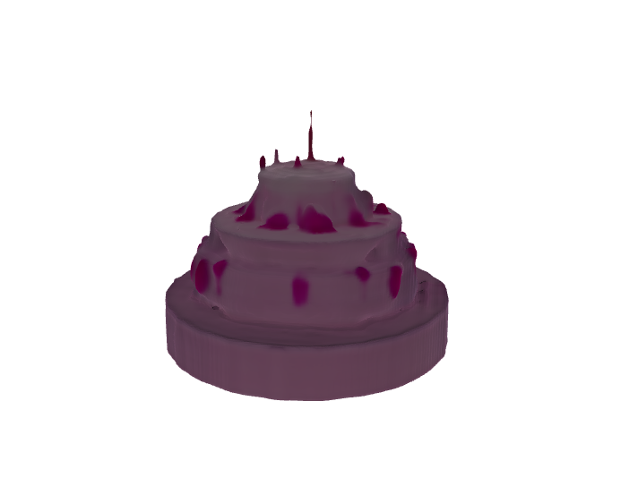

#  3D Model Generation 

This prototype uses OpenAI's **Shap-e** to generate 3D models from simple text prompts such as _"a toy car"_ or _"a chair"_. It outputs standard 3D file formats (`.obj`) and visualizations for inspection.

---

##  Features

-  Accepts short **text prompts** as input
-  Uses **OpenAI's Shap-e** for 3D model generation
-  Outputs `.obj` files
-  Renders model previews using `pyrender` and `matplotlib`


---

### Example: A pink birthday cake

*Generated 3D Output:*



---

##  Setup Instructions

### 1. Clone and Prepare

```bash
git clone https://github.com/openai/shap-e.git
cd shap-e
````


### 3. Install Dependencies

```bash
pip install -e .
pip install torch torchvision torchaudio --index-url https://download.pytorch.org/whl/cu121
pip install trimesh pyrender matplotlib pyyaml
```

---

## How to Use

1. **Launch the Notebook**
   Open `3d_model.ipynb` in Jupyter or VS Code.

2. **Enter a Prompt**
   Example:

   ```python
   prompt = "a small toy car"
   ```

3. **Generate and Export**
   The notebook will:

   * Generate a latent 3D model using `sample_latents`
   * Decode it
   * Save `.obj` files
   * Render a preview


## Example Output

| Prompt             | Output File | Visualization    |
| ------------------ | ----------- | ---------------- |
| `"a toy car"`      | `car.obj`   | Rendered 3D View |
| `"a modern chair"` | `chair.obj` | Rendered 3D View |

---

## Libraries Used

* `torch`, `torchvision`, `torchaudio` — for PyTorch backend
* `trimesh`, `pyrender`, `matplotlib` — for rendering and visualization
* `shap-e` — OpenAI's text-to-3D generation library

---

## Thought Process

* Selected Shap-E due to its well-maintained, open-source support for text-to-3D.
* Focused on clarity and modularity for reusability.
* Prioritized ease of running in both Colab and local environments.

---

